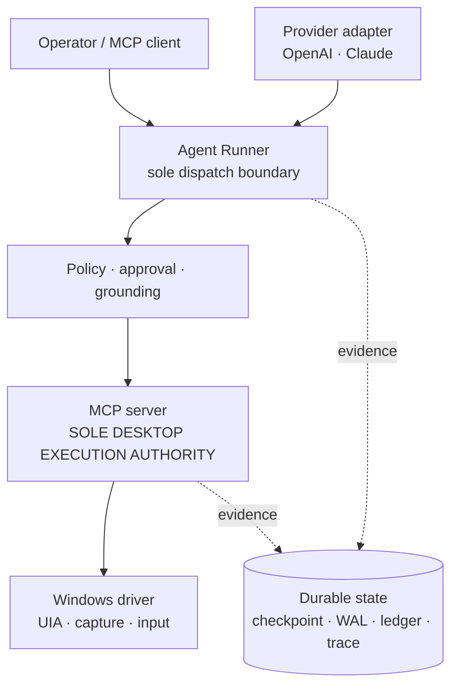

# Guarded Desktop Agent

**A durable, safety-governed computer-use runtime for Windows.**

Formerly `computer-use-mcp`. The new name distinguishes this repository and
its project-local MCP server from platform-provided computer-use plugins.
Legacy Python import paths, state directories, environment variables, and
console commands remain supported during the compatibility window.

[中文快速开始](README.zh-CN.md) · [Architecture](#architecture) · [Reliability demo](#try-the-reliability-demo) · [Evidence dashboard](docs/CAPABILITY_STATUS.md) · [Documentation](docs/README.md)

> **Status: experimental.** Windows-only, foreground desktop, primary display.
> The English documentation is canonical. Every claim below links to retained
> evidence; read [Honest limits](#honest-limits) before assuming more.

Letting a model click around a desktop is easy. Knowing *what it was allowed to
do*, *what it actually did*, and *what is safe to retry after the process dies*
is the hard part. This project keeps those layers separate: UI Automation,
bounded OCR, and bounded region capture for observation, an explicit policy and approval boundary, a single
desktop execution authority, and durable evidence that outlives a crash.

## What this proves

- **13 reviewed MCP tools** over stdio — `ui_snapshot`, `find`, `list_windows`,
  `screenshot`, `capture_region`, `ocr`, `document_text`, `activate_window`,
  `click`, `scroll`, `drag`, `type`, and `key` — with
  fixed schemas, argument validation, and discovery-mismatch checks.
- **Two provider paths** (OpenAI and Claude) behind one provider-neutral tool
  contract, with [retained dual-provider evidence](docs/E3_EVIDENCE.md).
- **Fresh grounding before a side effect**, and mandatory observation after it.
- **Recovery that never auto-replays an uncertain action.** A dispatch intent
  with no correlated completion stops for a human instead of guessing.
- **Versioned Full Cycle handoff, frozen locally at `324ff2fb`.** An offline CLI
  exports the reviewed runtime manifest and existing redacted run evidence
  without opening provider, desktop, MCP, approval, memory, or continuation
  ports. Lane B rich capture remains deferred and disabled by default.
- **Offline CI** on Windows across Python 3.11–3.13, plus a wheel clean-install
  smoke ([workflow](.github/workflows/ci.yml) ·
  [runs](https://github.com/kuoforever/guarded-desktop-agent/actions/workflows/ci.yml)).

## Measured results

| Result | Evidence |
| --- | --- |
| Forced-crash campaign: killed mid-flight, resumed in a fresh process, **0 duplicate side effects** at every fault point | [Reliability demo](docs/demo/README.md) |
| Reliability benchmark: **30 runs × 100 items**, a crash injected at every named fault point, **0 duplicate side effects**, every item either committed or parked for a human | [Benchmark evidence](docs/benchmark/README.md) |
| Windows activation repair: a five-case regression passed in an isolated VM | [E4 evidence](docs/E4_EVIDENCE.md) |
| Bounded OCR recovered a static tab that UIA omitted, matched to one UIA card | [OCR evidence](docs/BOSS_OCR_EVIDENCE.md) |
| One real BOSS page: 7 stable public job keys, 0 duplicates, 0 retries, 0 tokens — **measured under a contract the discovery-pass ledger has since replaced** | [Discovery evidence](docs/BOSS_CAMPAIGN_DISCOVERY_EVIDENCE.md) |
| Current BOSS discovery contract: 2 distinct on-device passes, 12 stable public job keys, 0 duplicates, 0 provider calls, 0 side effects | [Multi-pass discovery evidence](docs/BOSS_CAMPAIGN_MULTIPAGE_EVIDENCE.md) |
| Clean BOSS item/restart gate: 12 discovered identities, 3 consecutive fresh-run commits, 0 local correction, provider calls, tokens, retryable items, or uncertain items | [Clean item/restart evidence](docs/BOSS_ITEM_RESTART_CLEAN_EVIDENCE.md) |
| Partial BOSS item/restart diagnostic: 3 identity commits, clean post-fix stale-owner recovery, 0 provider calls, with two discovered defects explicitly retained | [Item/restart diagnostic evidence](docs/BOSS_ITEM_RESTART_DIAGNOSTIC_EVIDENCE.md) |

Each record supports **only its own scope**. None is application acceptance, and
none makes this a general-purpose worker. The superseded one-page row remains
for history; the current-contract row proves externally progressed discovery
only. The clean item/restart row proves public-identity processing and fresh-run
handoff, not semantic extraction, provider execution, automatic navigation, or
complete application acceptance.

The [capability dashboard](docs/CAPABILITY_STATUS.md) states, per layer, what is
designed, implemented, offline-verified, provider-verified, desktop-verified,
and application-verified.

For the external model lifecycle, use the bounded Lane A bridge:

~~~powershell
guarded-desktop-agent fullcycle manifest `
  --output C:\absolute\path\runtime-manifest.json

guarded-desktop-agent fullcycle export-run `
  --config C:\absolute\path\agent.toml `
  --run-id <run-id> `
  --output C:\absolute\path\run-export.json
~~~

These files support reliability, safety, failure, sequence, and verifier
evaluation. They intentionally contain no screenshots or raw semantic content
and are not multimodal training episodes. See
[Full Cycle integration](docs/FULLCYCLE_INTEGRATION.md).

## Architecture

**The MCP server is the only path to the desktop.** No provider adapter, plan,
or campaign reaches the driver another way, so every desktop effect crosses the
same policy, grounding, and audit boundary exactly once.

## Why this is different

- **Least privilege by default.** `safe_local` gates actions on the foreground
  window's *process ancestry*, not just its executable name, and yields while a
  human is typing.
- **A ref is intent, not a coordinate.** A `ref` action never silently degrades
  into a center-point click: a stale or occluded element fails loudly instead of
  clicking whatever moved into that pixel.
- **Uncertainty is a first-class state.** Known-completed, known-not-dispatched,
  and unknown are distinct outcomes. Only the first two may proceed on their own.
- **Evidence integrity is maintained by CI, not by hand.** Dated records keep the
  numbers their own run observed; current-state documents are checked against the
  reviewed tool registry.

## Try the reliability demo

Offline: no provider, no desktop, no tokens. Kill a multi-item campaign at a
named fault point and watch a fresh process decide what it may resume.

~~~powershell
# crash between the durable intent and the side-effect result
.\.venv\Scripts\python.exe scripts\demo_reliability_campaign.py `
    --state-dir out\demo --items 5 `
    --fault-point after_dispatch_intent --fault-ordinal 3
~~~

The item whose outcome is unknown is parked as `UNCERTAIN` for a human, the rest
of the campaign still completes, and the command exits non-zero if a duplicate
side effect was ever attempted. The [runbook](docs/demo/README.md) has the full
fault matrix.

## Safety first

Desktop actions can move the pointer, change focus, type text, and invoke UI
controls. Start with `safe_local`, keep the allowlist narrow, and use a
non-sensitive test application such as Notepad.

`full_control_local` deliberately bypasses the foreground allowlist and
human-activity yielding checks. It still has audit logging and an emergency
stop, but it should be used only when an operator explicitly intends to hand
over the local desktop.

Read [Configuration and safety](docs/CONFIGURATION.md) before enabling action
tools.

## Desktop Ask quick start

Use Python 3.11, 3.12, or 3.13. Download the `0.1.0` wheel from the
[GitHub release](https://github.com/kuoforever/guarded-desktop-agent/releases/tag/v0.1.0)
and verify its SHA-256 against the release record. The example below installs
the OpenAI adapter; use `agent-anthropic`, `anthropic`, and
`ANTHROPIC_API_KEY` for Claude.

~~~powershell
py -3.13 -m venv .venv
.\.venv\Scripts\python.exe -m pip install `
  ".\guarded_desktop_agent-0.1.0-py3-none-any.whl[agent-openai]"

.\.venv\Scripts\guarded-desktop-agent.exe config setup

$env:OPENAI_API_KEY = "<provider credential>"

.\.venv\Scripts\guarded-desktop-agent.exe config settings
~~~

`config setup` prints the exact `config doctor --config ...` command for its
user-local configuration. Run that command before asking the first question.
The safe-pause chord defaults to `ctrl+alt+p`; setup may choose another letter,
for example `config setup --pause-shortcut ctrl+alt+k`. G and Q remain reserved.

Open a non-sensitive test document in Notepad, Word, or a browser and leave it
in the foreground. Ask one read-only question:

~~~powershell
.\.venv\Scripts\guarded-desktop-agent.exe ask `
  --config "$env:LOCALAPPDATA\computer-use-agent\agent.toml" `
  --task "Summarize the foreground document in three bullets."
~~~

`ask` prints the answer directly. Add `--json` to retain the run ID, plan ID,
observation count, and usage metadata. It can plan one to four reviewed
observations, including bounded UIA `document_text`; it cannot plan a desktop
side effect. The generated configuration stores no credential, uses the
user-local state directory, and enables the short-lived continuation WAL that
the observation/final-response path requires. New generated product profiles
also enable every current UI/UX boolean by default: passive action feedback,
presence, progress, reduced motion, high contrast, and Decision Cards. These
settings add visibility and local interaction only; they grant no model or
desktop authority, and every surface remains explicitly configurable.

`config settings` is the CLI-first Agent Controls view. It explains purpose,
provider/model, safety, interface preferences, and exact next commands from the
same strict TOML source. It only reports provider SDK and credential-variable
presence, opens no external port, registers no shortcut, and grants no
approval, control, retry/replay, or dispatch authority. Use `--json` for the
same bounded facts.

Optionally keep a second terminal open for global Agent Controls and safe pause:

~~~powershell
.\.venv\Scripts\guarded-desktop-agent.exe shortcuts run `
  --config "$env:LOCALAPPDATA\computer-use-agent\agent.toml"
~~~

`Ctrl+Alt+G` restores that host's Agent Controls console. The configured pause
chord (default `Ctrl+Alt+P`) requests cooperative pause but grants no desktop
authority until the host reports
`PAUSED · DESKTOP AUTHORITY RELEASED`. `Ctrl+Alt+Q` remains the independent MCP
emergency stop. There is no global approve or resume; closing the host releases
both registered shortcuts. See [Quick Setup and Agent Controls](docs/AGENT_CONTROLS.md).

`config doctor` is the installed-runtime readiness check. It validates the
configuration, provider extra and documented credential variable, MCP
executable and working directory, then starts the installed MCP child long
enough to verify the exact thirteen-tool `initialize` / `list_tools` contract.
It prints fixed JSON and exits `0` only when every check passes (`2` for one
actionable failure). It sends no provider request, invokes no MCP tool, reads no
desktop content, and performs no desktop action. MCP startup can still create
its configured audit directory and start its emergency-stop key polling before
the child is closed.

This path is offline verified and has a same-wheel current-candidate
[OpenAI/Windows/Notepad result](docs/CURRENT_CANDIDATE_PRODUCT_INTEGRATION_EVIDENCE.md).
That bounded result does not establish another provider, application, desktop
action, or release artifact.

## Read-only Task Center

Inspect validated local run and campaign state without opening a provider, MCP,
or desktop connection:

~~~powershell
guarded-desktop-agent task center --config C:\absolute\path\agent.toml
guarded-desktop-agent task center --config C:\absolute\path\agent.toml --json
~~~

The human-first view groups Attention, In progress, and History and renders
fixed Completion/Failure Receipts. It cannot approve, resume, retry, cancel, or
advance work. `UNKNOWN_OUTCOME` explicitly warns against automatic retry. A
successful `public-web-word` workflow also writes a strict immutable local
receipt after save, digest, reopen, and cleanup verification; only that receipt
allows Task Center to claim the DOCX was saved and verified. See the complete
[Task Center and receipt contract](docs/TASK_CENTER.md).

## Read-only Approval Inbox

When a configured Decision Card is waiting, inspect its bounded local attention
record from another terminal:

~~~powershell
guarded-desktop-agent approval inbox --config C:\absolute\path\agent.toml
guarded-desktop-agent approval inbox --config C:\absolute\path\agent.toml --json
~~~

The Inbox reports only validated Host identity, fixed action classification,
digests, and expiry. It cannot approve, deny, defer, take over, resume, retry,
or dispatch work, and `pending_at_last_record` does not claim the Runner is
still live. Generated product profiles also enable a fixed-content Windows
attention notification with no action button or private task/action content.
The operator must return to the bound Decision Card. See the full
[Approval Inbox and notification contract](docs/APPROVAL_INBOX.md).

## Public Web to Word workflow

Create the dedicated supervised profile, check readiness, then write one new
DOCX from the fixed public Microsoft Support source:

~~~powershell
guarded-desktop-agent config init `
  --profile public-web-word `
  --provider openai `
  --model <reviewed-model-id> `
  --output C:\absolute\path\public-web-word.toml

guarded-desktop-agent config doctor `
  --config C:\absolute\path\public-web-word.toml

guarded-desktop-agent review public-web-word `
  --config C:\absolute\path\public-web-word.toml `
  --output C:\absolute\path\collaboration-brief.docx

guarded-desktop-agent workflow public-web-word `
  --config C:\absolute\path\public-web-word.toml `
  --output C:\absolute\path\collaboration-brief.docx
~~~

The review-only command displays the Host-fixed goal, applications, read/change
boundary, exact output, maximum seven side effects, low-risk Host authorization,
zero expected high-risk approvals, stop conditions,
and possible partial files without contacting a provider, starting MCP, opening
an application, or creating workflow state. The workflow command shows the same
Scope Sheet and requires the exact token `START` before startup. An intentional
non-interactive caller must add `--acknowledge-scope`; this starts the ordinary
workflow but does not approve any desktop action. See the
[Pre-run Review contract](docs/PRE_RUN_REVIEW.md).

The model chooses the reviewed steps and authors two to four bullets from fresh
Chrome observations; no bullet findings are prewritten in the task or template.
The workflow uses the ordinary Runner policy boundary: exact Host-validated
low-risk steps proceed without prompting, while high-risk work still requires
local approval and ambiguity fails closed. It saves without overwriting, closes
the exact fixtures, reopens the same DOCX, and reads it back
through Runner/MCP before returning bounded JSON metadata. See the full
[workflow contract](docs/PUBLIC_WEB_WORD_WORKFLOW.md) and the same-wheel
[current-candidate integration result](docs/CURRENT_CANDIDATE_PRODUCT_INTEGRATION_EVIDENCE.md).

While one of those Runner loops is live, a second local terminal can request
cooperative control:

~~~powershell
guarded-desktop-agent task takeover --config C:\absolute\path\public-web-word.toml
guarded-desktop-agent task control --config C:\absolute\path\public-web-word.toml
# Touch the desktop only after status=paused and authority=released.
guarded-desktop-agent task resume --config C:\absolute\path\public-web-word.toml
~~~

`pause_requested` is not a completed pause. Explicit resume discards the old
approval and grounding and requires a durable fresh observation before any
later side effect. In-flight uncertainty remains terminal and is never
replayed. See [Cooperative Pause, Takeover, and Resume](docs/COOPERATIVE_CONTROL.md).

## Raw MCP server quick start

Create a virtual environment and install the package:

~~~powershell
py -3.13 -m venv .venv
.\.venv\Scripts\python.exe -m pip install -e .
~~~

Run the server in its default safe mode. The example limits foreground actions
to Notepad:

~~~powershell
$env:CUMCP_ALLOWLIST = "notepad.exe"
.\.venv\Scripts\guarded-desktop-mcp.exe
~~~

Register the executable with an MCP client using that client's stdio-server
configuration. Prefer an absolute executable path so the client does not depend
on an activated virtual environment:

~~~json
{
  "command": "C:\\absolute\\path\\to\\guarded-desktop-agent\\.venv\\Scripts\\guarded-desktop-mcp.exe",
  "env": {
    "CUMCP_ALLOWLIST": "notepad.exe"
  }
}
~~~

The exact configuration wrapper varies by MCP client; the command and
environment values above are the portable part.

The legacy `computer-use-mcp` and `computer-use-agent` entry points remain
aliases for existing integrations. New configurations should use
`guarded-desktop-mcp` and `guarded-desktop-agent`.

## Typical workflow

1. Call `ui_snapshot()` to obtain a flat list of interactive controls and
   their `ref_N` handles, call `ocr(x, y, w, h)` for bounded static text, call
   `capture_region(x, y, w, h)` for one cropped image, or call `screenshot()`
   for whole-display visual inspection.
2. Prefer `click(ref="ref_N")` and `type(text, ref="ref_N")` when UIA
   exposes the target. These use accessibility patterns rather than synthetic
   coordinate clicks.
3. Use `click(x=..., y=...)` only for visual/canvas-style targets that UIA
   cannot expose. Coordinates share the primary-display pixel space shown by
   `screenshot()`.
4. Inspect the returned result and audit log before proceeding with another
   action.

## Tool surface

| Tool | Current behavior |
| --- | --- |
| `ui_snapshot(scope="foreground")` | Returns a flat, capped UIA control list with session-scoped refs. |
| `find(query, scope="foreground")` | Returns a smaller matching subset of a UIA snapshot. |
| `list_windows()` | Lists visible top-level windows, including owned dialogs. |
| `screenshot()` | Returns a PNG of the primary display; it has no MCP region parameter. |
| `capture_region(x, y, w, h)` | Returns a grounding envelope plus a PNG of one explicit primary-display region. |
| `ocr(x, y, w, h)` | Recognizes bounded text runs in one explicit primary-display region. |
| `document_text(scope="foreground")` | Reads bounded ordered semantic text through UIA TextPattern. |
| `activate_window(window_id)` | Attempts to restore and activate a listed window; success requires the driver to verify that it became foreground. |
| `click(ref=...)` / `click(x=..., y=...)` | Invokes an accessible control or performs a coordinate click. |
| `scroll(x, y, delta_x=0, delta_y=0)` | Scrolls at one screenshot-grounded point. |
| `drag(x, y, to_x, to_y, duration_ms=250)` | Drags between two screenshot-grounded points. |
| `type(text, ref=None)` | Sets an accessible value when a ref is supplied, otherwise types into focus. |
| `key(combo)` | Sends a key chord to the foreground window. |

See the exact parameters, ref lifecycle, safeguards, and errors in
[Tool reference](docs/TOOLS.md).

## Honest limits

- **Windows only**, Python 3.11 through 3.13, stdio MCP transport. macOS, Linux,
  multi-monitor grounding, and isolated-worker orchestration are roadmap items,
  not current capabilities.
- **Foreground desktop, primary display.** This is not a background worker.
- **Not a browser automation framework.** Chromium-family UIA trees may be
  incomplete until accessibility content is exposed; verify per application.
- **No application acceptance.** The retained BOSS records cover bounded
  read-only observation of specific pages. They do not support any claim about
  automated applications, messages, or a general campaign worker.
- `screenshot()` captures the primary display only. Multi-monitor coordinate
  support is not yet implemented.
- A shared desktop has one foreground window, pointer, and keyboard focus.
  This project does not promise safe, parallel background control on that
  desktop.
- The VMware helper can start an existing VM, but it does not create the guest,
  start its MCP server, or provide host-to-guest MCP transport.
- Screenshot redaction is title-substring based; it is not comprehensive secret
  detection.

## Documentation

| Need | Read |
| --- | --- |
| Inspect the frozen Full Cycle Runtime baseline or intentionally reopen work | [Project status](PROJECT_STATUS.md) |
| Use this Runtime from the Multimodal LLM Full Cycle project | [Full Cycle integration](docs/FULLCYCLE_INTEGRATION.md) |
| Understand the complete project, every feature family, implementation path, quality attribute, status, and next gate | [Project overview](docs/PROJECT_OVERVIEW.md) |
| Find the right document | [Documentation index](docs/README.md) |
| See what is implemented, verified, or still planned | [Capability status](docs/CAPABILITY_STATUS.md) |
| Run the crash/resume reliability demo and read its fault matrix | [Reliability demo](docs/demo/README.md) |
| Configure modes, safeguards, and environment variables | [Configuration and safety](docs/CONFIGURATION.md) |
| Use the MCP API exactly | [Tool reference](docs/TOOLS.md) |
| Understand the implementation architecture | [Design](docs/DESIGN.md) |
| Understand why a safety rule exists, and what was rejected | [Architecture decision records](docs/adr/) |
| Read a failure analysis with root cause and detection gap | [Postmortems](docs/postmortems/) |
| Know how coding agents are used here and who is responsible | [AI-assisted development](docs/AI_ASSISTED_DEVELOPMENT.md) |
| Implement a platform driver | [Driver Contract](docs/DRIVER_CONTRACT.md) |
| Test or maintain the project | [Development](docs/DEVELOPMENT.md) and [Maintainer handoff](HANDOFF.md) |
| Report a vulnerability, or see what counts as one | [Security policy](SECURITY.md) |
| See what changed in a packaged version | [Changelog](CHANGELOG.md) |
| See completed and future work | [Roadmap](docs/EXECUTION_PLAN.md) |
| Review the planned full Agent Host | [Agent implementation plan](docs/AGENT_IMPLEMENTATION_PLAN.md) |
| Design day-scale resumable work | [Long-running tasks](docs/LONG_RUNNING_TASKS.md) |
| Run staged real-application campaigns and coverage benchmarks | [Application evaluation matrix](docs/APPLICATION_EVALUATION_MATRIX.md) |
| Review the planned one-campaign complete-product showcase | [Universal GUI demo](docs/UNIVERSAL_GUI_DEMO.md) |
| Reduce model context and observation cost | [Token efficiency](docs/TOKEN_EFFICIENCY.md) |
| Review the planned computer-use indicator, progress UI, and decision experience | [Operator experience](docs/OPERATOR_EXPERIENCE.md) |

## License

Licensed under the [Apache License 2.0](LICENSE). You may use, modify, and
distribute this project, including commercially, subject to the license terms.
